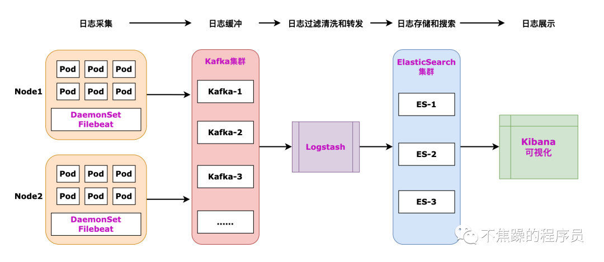

## ES介绍
下面介绍Kubernetes场景下基于ELK的日志解决方案。整体思路：Filebeat -> Kafka -> Logstash -> Elasticsearch -> Kibana。
### 1、日志数据流转
日志数据流转见下图：

### 2、日志采集
#### 2.1、容器日志在哪儿
首先得有个概念：容器只是K8S集群Node上的一个进程。要在K8S集群机器上找到此Docker进程，然后进入到对应的文件夹里查看日志文件。
一般情况下，容器的日志存放在宿主机上的这个目录下/var/lib/docker/containers/：
日志在宿主机的这个文件夹下
cd /var/lib/docker/containers
 用这个命令可以查找对应的日志文件
find /var/lib/docker/containers -name "*-json.log"
进入到/var/lib/docker/containers/下，看到的是一堆毫无规律的文件夹。

看到这些毫无规律的文件夹名称，会一下子有点懵，但是仔细看看，其实这些码是对应的Docker容器的id。继续通过名称查看容器id。
docker命令查看容器
docker ps -a

找到了容器id之后，可以看到用容器id的前几位，可以完全匹配到，日志文件夹名称的前几位。docker ps 显示的容器id只是显示了整个id的前几位。

进入到日志文件夹后，就可以看到具体的json日志文件了。

至此已经知道日志文件存放的位置了。当然啦，要控制好日志级别，还要做好日志清理任务，否则大量的日志会导致磁盘空间不够。Pod销毁之后，日志文件也会被销毁的。
文件找到了接下来，就看怎么采集日志了。
#### 2.2、日志采集工具
日志采集工具有多种，本文采用Filebeat作为日志采集工具。
Filebeat是用于转发和汇总日志与文件的轻量级传送程序。作为服务器上的代理安装，Filebeat会监视你指定的日志文件或位置。然后收集日志事件，并将它们转发到Elasticsearch或Logstash或Kafka。官方文档显示的工作流程如下：

Filebeat的主要优势有：
- 轻量级并且易使用
- 免费开源
- 资源使用率低
- 良好的性能
#### 2.3、日志如何采集（区分log日志和pod日志，显示K8S 名字）
两个集群加入同一个es里面需要注意优先级
只需给集群 2 的模板设置更高优先级，让 ES 优先匹配它，冲突即可解决：

日志采集工具选型确定之后，接下来就是如何采集了。
K8S部署的场景下，想要收集每台Node下的容器日志，需要采用Deamonset控制器自动部署，这样每次新增节点时，会自动部署Filebeat的Pod。每台Node自动安装好Filebeat后，每台Node上的日志会被自动采集，然后输出到Kafka。
** Filebeat大致的编排yaml如下：**
``` yml
filebeat-fixed-complete.yaml
apiVersion: v1
kind: ServiceAccount
metadata:
  name: filebeat
  namespace: elk
---
apiVersion: rbac.authorization.k8s.io/v1
kind: ClusterRole
metadata:
  name: filebeat
rules:
- apiGroups: [""]
  resources:
  - namespaces
  - pods
  - nodes
  verbs:
  - get
  - watch
  - list
---
apiVersion: rbac.authorization.k8s.io/v1
kind: ClusterRoleBinding
metadata:
  name: filebeat
subjects:
- kind: ServiceAccount
  name: filebeat
  namespace: elk
roleRef:
  kind: ClusterRole
  name: filebeat
  apiGroup: rbac.authorization.k8s.io
---
apiVersion: v1
kind: ConfigMap
metadata:
  name: filebeat-config
  namespace: elk
data:
  filebeat.yml: |
    filebeat.inputs:
    - type: container 
    # 因为是采集的容器日志，所以这里要用container 不能用 log，否则拿不到容器日
    # - type: log
      paths:#采集环境的所有日志
        - /var/log/containers/*.log
        - /var/log/pods/*/*/*.log
        - /data/docker/containers/*/*-json.log
      ignore_older: 24h
      clean_inactive: 48h
      clean_removed: true
      json.ignore_decoding_error: true
      json.keys_under_root: true
      json.overwrite_keys: true
      json.add_error_key: true

    # 禁用数据流并使用传统索引
    setup.ilm.enabled: false
    setup.template:
      name: "k8s-logs"
      pattern: "k8s-logs-*"
    # 优先级
    priority: 200  # 新增这一行，优先级高于集群1的150
      enabled: true
    setup.template.settings:
      index.number_of_shards: 1
      index.number_of_replicas: 1

    processors:
      # ✅ 1. 修复 ES 字段冲突，将 log 改为 message
      - rename:
          fields:
            - from: "log"
              to: "message"
          ignore_missing: true
          fail_on_error: false

      # ✅ 2. 自动添加 K8s 元数据（Pod、Namespace 等）
      - add_kubernetes_metadata:
          host: ${NODE_NAME}
          matchers:
            - logs_path:
                logs_path: "/var/log/containers/"
            - logs_path:
                logs_path: "/var/log/pods/"
                # - container_id:
                #paths:
                # - "/data/docker/containers/{{.ContainerID}}/*-json.log"  # Docker原始日志
                #- pod_uid:
                #paths:
                #  - "/var/lib/kubelet/pods/{{.PodUID}}/volumes/*/data/logs/*.log"  # emptyDir日志路径

      # ✅ 3. 添加集群自定义字段
      - add_fields:
          target: ""
          fields:
            log_source: "docker-containers"
            cluster_name: "production-k8s"

    # ✅ 4. Elasticsearch 输出配置
    output.elasticsearch:
      hosts: ["10.6.20.153:9200"]
      #  username: "elastic"          # 可修改
      #  password: "your_password"    # 可修改
      index: "k8s-logs-%{+yyyy.MM.dd}"
      bulk_max_size: 100
      worker: 2
      timeout: 30
      max_retries: 5
      compression_level: 3

    logging.level: info
    logging.to_files: false
    logging.metrics.enabled: false
---
apiVersion: apps/v1
kind: DaemonSet
metadata:
  name: filebeat
  namespace: elk
spec:
  selector:
    matchLabels:
      k8s-app: filebeat
  template:
    metadata:
      labels:
        k8s-app: filebeat
    spec:
      serviceAccountName: filebeat
      hostNetwork: true
      dnsPolicy: ClusterFirstWithHostNet
      containers:
      - name: filebeat
        # ✅ 你当前使用 ARM64 版本镜像，可替换为官方：
        # image: docker.elastic.co/beats/filebeat:8.18.6
        image: swr.cn-north-4.myhuaweicloud.com/ddn-k8s/docker.io/elastic/filebeat:8.18.6-linuxarm64
        args: ["-c", "/etc/filebeat.yml", "-e"]
        env:
        - name: NODE_NAME
          valueFrom:
            fieldRef:
              fieldPath: spec.nodeName
        securityContext:
          runAsUser: 0
        resources:
          limits:
            memory: 500Mi
          requests:
            cpu: 100m
            memory: 200Mi
        volumeMounts:
        - name: config
          mountPath: /etc/filebeat.yml
          subPath: filebeat.yml
        - name: varlogcontainers
          mountPath: /var/log/containers
          readOnly: true
        - name: varlogpods
          mountPath: /var/log/pods
          readOnly: true
        - name: datadockercontainers
          mountPath: /data/docker/containers
          readOnly: true
      volumes:
      - name: config
        configMap:
          name: filebeat-config
      - name: varlogcontainers
        hostPath:
          path: /var/log/containers
      - name: varlogpods
        hostPath:
          path: /var/log/pods
      - name: datadockercontainers
        hostPath:
          path: /data/docker/containers
      tolerations:
      - operator: Exists
```
3、日志缓冲、过滤清洗、存储、展示
3.1、缓冲
Kafka是一个消息处理引擎，这里采用Kafka作为日志数据的缓冲工具。采用Kafka有2个用途：
- 作为缓冲，防止日志量太大导致下游来不及消费，所以要加入消息缓冲这一层。这一层必不可少。
- Kafka消息可以被别的应用监听消费，过滤输出到一些告警信息到企微、钉钉、邮件等。
3.2、过滤清洗和转发
Logstash 是一个日志收集和处理引擎，它带有各种各样的插件，能够从各种来源摄取数据。并且可以对数据进行转换，然后转发到目的地。我这里采用Logstash作为日志摄取、过滤、清洗、转发的工具。
这是一个大概的Logstash Conf文件，文件的内容分3块：input 、filter 、output。

input {
    kafka {
        bootstrap_servers=>"172.10.7.79:9092"
        topics=>["topic-bizlogs"]
        codec => "json"
    }
}
 
filter{
    mutate{
        split => ["message", "|"]
        add_field => { "log_time" => "%{[message][0]}"}
        add_field => { "level" => "%{[message][1]}"}
        add_field => { "class" => "%{[message][2]}"}
        add_field => { "line" => "%{[message][3]}"}
        add_field => { "thread" => "%{[message][4]}"}
        add_field => { "log_message" => "%{[message][5]}"}
 
        add_field => { "env" => "%{[kubernetes][namespace]}"}
        add_field => { "podName" => "%{[kubernetes][pod][name]}"}
        add_field => { "podId" => "%{[kubernetes][pod][uid]}"}
        add_field => { "image" => "%{[container][image][name]}"}
        add_field => { "imageId" => "%{[container][id]}"}
        add_field => { "nodeId" => "%{[kubernetes][node][uid]}"}
        add_field => { "nodeName" => "%{[kubernetes][node][name]}"}
        add_field => { "nodeHostName" => "%{[kubernetes][node][hostname]}"}
        add_field => { "logPath" => "%{[log][file][path]}"}
        add_field => { "appName" => "%{[kubernetes][labels][app]}"}
 
        remove_field => ["agent","fields","input","ecs","host","@version","kubernetes","stream","log","container"]
    }
}
 
output{
        elasticsearch{
                hosts=>["172.11.4.82:9200"]
                index => "%{appName}‐%{+YYYY.MM.dd}"
 
        }
}一键获取完整项目代码go
3.3、存储和搜索
Elasticsearch是一个可扩展的搜索引擎，这里采用Elasticsearch作为日志存储搜索工具。
3.4、展示
采用Kibana为日志构建可视化的UI。
4、总结
本文主要介绍Kubernetes场景下比较接地气好落地的，基于ELK的日志解决方案。整体思路：Filebeat -> Kafka -> Logstash -> Elasticsearch -> Kibana。
本文没有介绍Kafka、Logstash、Elasticsearch、Kibana的安装，只提及了一些配置文件，安装过程读者自行查阅资料搭建。
本文转载自：「不焦躁的程序员」，原文：https://url.hi-linux.com/Eh68Q，版权归原作者所有。欢迎投稿，投稿邮箱: editor@hi-linux.co


